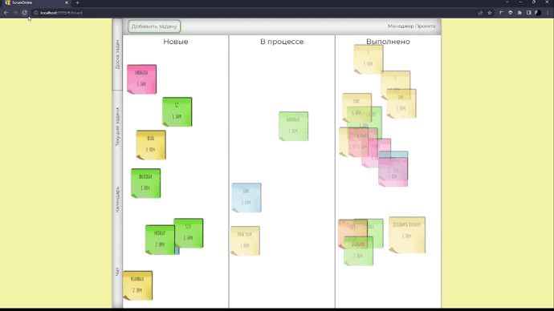

#  ScrumOnline
<p>This project was created in the process of studying at IT-Academy.</p>
<p>The basis of this project is the Scrum methodology.
It is designed to transfer the interaction with the task board and between specialists with different stacks to the online.</p>



<h2>Technologies</h2>

<ul>
  <li>SCSS</li>
  <li>JavaScript</li>
  <li>Node.js</li>
  <li>Express.js</li>
  <li>MongoDB</li>
  <li>WebPack</li>
  <li>Templates</li>
</ul>

<h2>To set up the database</h2>

You must create database with name 'Project'.
It must contain 4 collections:
<ul>
  <li>Authorization;</li>
  <li>Chat;</li>
  <li>Projects;</li>
  <li>UsersData.</li>
</ul>

Collection 'Authorization' must contain documents of the form:

```
{
  _id: ObjectId('...'), //generated automatically
  login: '...',
  password: '...'
}
```

Collection 'UsersData' must contain documents of the form:

```
{
  _id: ObjectId('...'), //generated automatically
  name: '...',
  stack: '...', //'manager' (for adding new tasks), 'front-end', 'back-end' or 'designer
  authorization: ObjectID('...') //must match the id from the collection 'Authorization'
}
```

Collection 'Chat' must contain one document of the form:

```
{
  _id: ObjectId('...'), //generated automatically
  name: 'Chat',
  messages: []
}
```

Collection 'Projects' will be updated automatically after adding new tasks by manager.

<h2>To launch the application</h2>

<h3>To launch client side</h3>

`npm run start`

<h3>To launch server side</h3>

You have to insert your database URI on line 5 and use in Terminal:

`npm run start`
